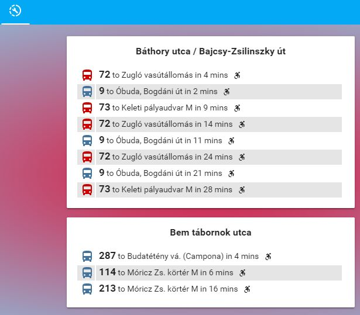

# Custom components for Home Assistant
## BKK stop custom component
## Providing also a state card for legacyUI and a custom card for Lovelacw

This custom component and custom card shows Budapest Public Transportation (BKK)
line information departing in the near future from a configurable stop.

Please note that the structure of custom components has changed as of version 0.93.0. 
See [https://developers.home-assistant.io/blog/2019/04/12/new-integration-structure.html](https://developers.home-assistant.io/blog/2019/04/12/new-integration-structure.html).

#### Configuration variables:
**name** (Optional): Name of component<br />
**stopId** (Required): StopId as per [futar.bkk.hu](http://futar.bkk.hu)<br />
**minsAfter** (Optional): Number of minutes ahead to show vehicles departing from station (default: 20)<br />
**wheelchair** (Optional): Display vehicle's wheelchair accessibility (default: false)<br />
**bikes** (Optional): Display whether bikes are allowed on vehicle (default: false)<br />
**ignoreNow** (Optional): Ignore vehicles already in the station (default: true) <br />

#### Lovelace UI
Lovelace UI does not support platform attributes natively.
Inspired by [entity-attributes-card](https://github.com/custom-cards/entity-attributes-card)
on handling attributes in Lovelace, a custom BKK Stop card was a dept and now made available for Lovelace UI.

Once bkk-stop-card.js got downloaded into your $homeassitant_config_dir/www, add the following lines to your ui-lovelace.yaml:
```
resources:
  - {type: module, url: '/local/bkk-stop-card.js'}

    cards:
      - type: custom:bkk-stop-card
        entity: sensor.bkk7u
```

#### Legacy UI
Custom state card is provided for presenting data on UI. Pls see the legacyUI directory structure as example.

#### Example
```
platform: bkk_stop
name: 'bkk7u'
stopId: 'BKK_F00940'
minsAfter: 25
wheelchair: true
```

Lovelace UI:


Legacy UI:

